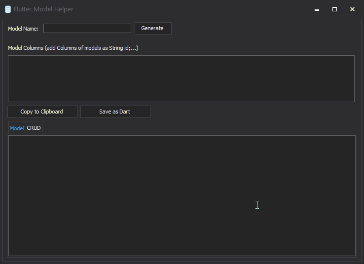
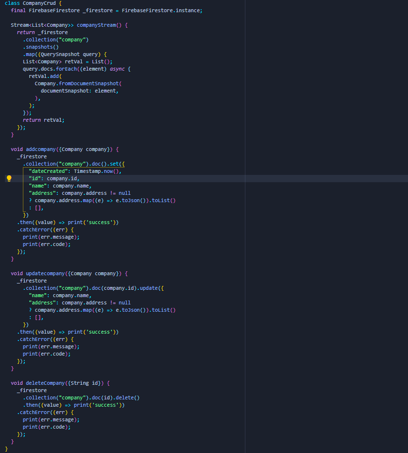
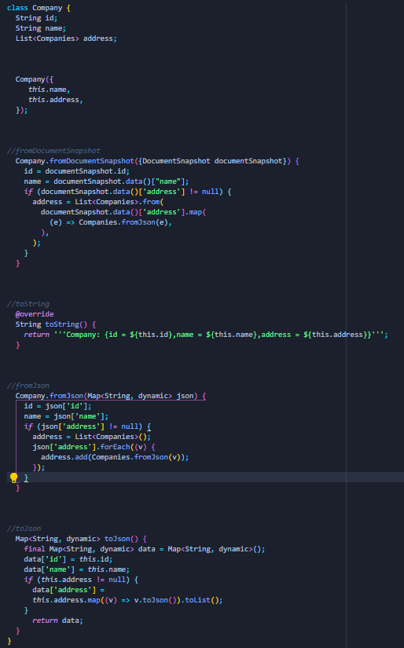

# Flutter Model Helper

It can generate model and model CRUD for you in less than minute by just adding the model name and model columns. Currently only available for Windows. macOSX and Linux support will come soon. If you guy's like this please give this repo a star.

This is a demo.

And here are the results

