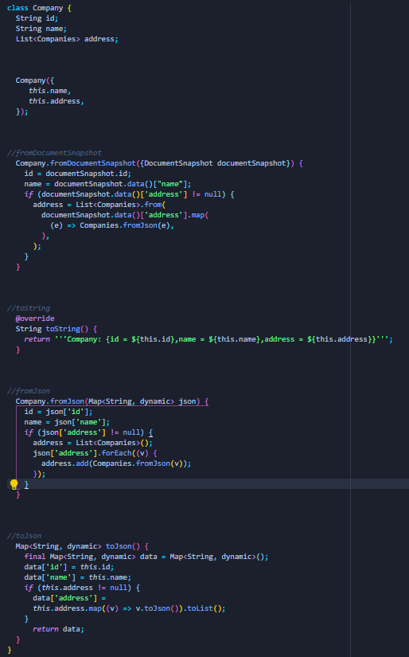

# Flutter Model Helper
It can generate model and model CRUD for you in less than minute by just adding the model name and model columns. 

~~Currently only available for Windows. macOSX and Linux support will come soon. Now supports Windows, macOS and Linux.~~

# Currently Work in proggress
Written in Dart/Flutter This version will support Desktop, Web and Mobile.

If you guy's like this please give this repo a star.

This is a demo.

And here are the results

